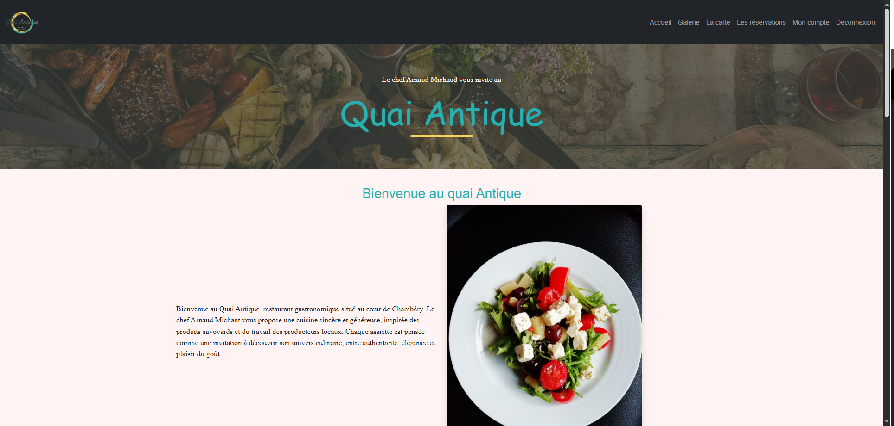
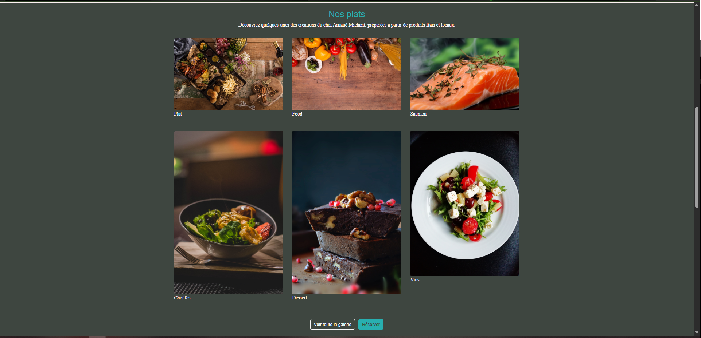
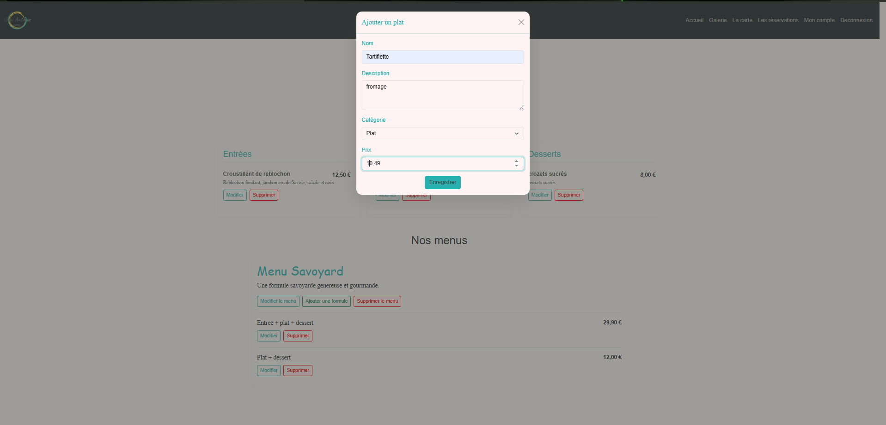
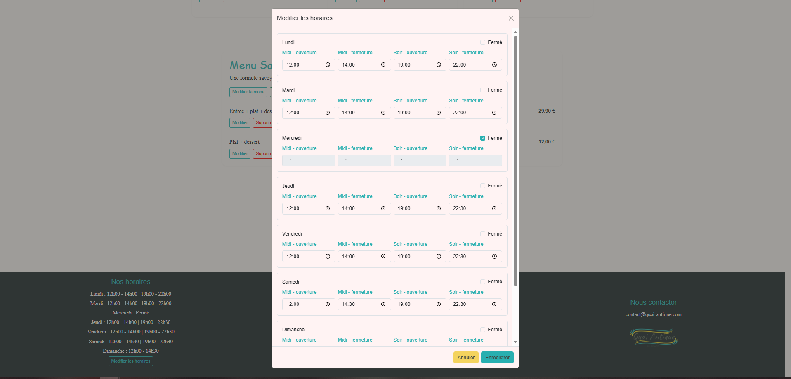
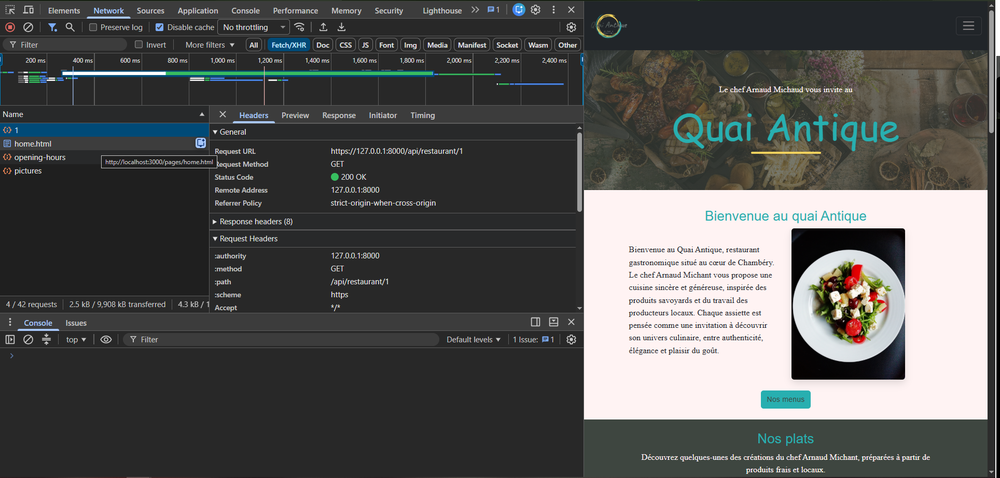
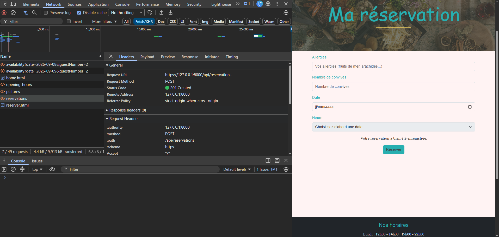

# Quai Antique — Frontend

[]()
[]()
[]()
[]()
[]()
[]()

---

## Description

**Quai Antique** est une application web de restauration développée dans le cadre de l'Évaluation en Cours de Formation du **Graduate Développeur Web Full Stack — STUDI**.

Ce dépôt contient le *frontend* de l'application.

L'interface a été développée en **HTML5**, **Sass/SCSS**, **JavaScript Vanilla** et **Bootstrap 5**. Elle communique avec une *API Symfony* dédiée afin de gérer les données et la logique métier de l'application.

Le projet propose une expérience différente selon le rôle de l'utilisateur : *visiteur*, *client connecté* ou *administrateur*.

---

## Fonctionnalités

### Visiteur

- Consulter la page d'accueil
- Découvrir les photos du restaurant
- Afficher le titre d'une photo au survol
- Consulter la galerie complète
- Consulter la carte et les plats par catégorie
- Consulter les menus et leurs formules
- Consulter les horaires d'ouverture
- Vérifier les disponibilités d'une réservation
- Réserver une table sans créer de compte
- Créer un compte client
- Se connecter à l'application

### Client connecté

En complément des fonctionnalités publiques :

- Réserver une table avec préremplissage des préférences
- Utiliser son nombre habituel de convives
- Utiliser ses allergies enregistrées
- Consulter et modifier ses informations personnelles
- Modifier son mot de passe
- Supprimer son compte
- Se déconnecter

### Administrateur

L'interface adapte dynamiquement les fonctionnalités accessibles selon le rôle de l'utilisateur.

Un administrateur peut notamment :

- Ajouter, modifier et supprimer les photos de la galerie
- Gérer les plats et leurs catégories
- Gérer les menus et leurs formules
- Modifier les horaires d'ouverture
- Définir la capacité maximale du restaurant
- Accéder aux fonctionnalités réservées à `ROLE_ADMIN`

---

## Conformité fonctionnelle ECF

Le frontend implémente les principales User Stories du sujet :

- *US1 — Connexion* : formulaire commun pour les clients et les administrateurs.
- *US2 — Galerie* : photos dynamiques, titre au survol, administration de la galerie et accès rapide à la réservation.
- *US3 — Carte* : affichage des plats avec catégorie, description et prix.
- *US4 — Menus* : affichage des menus et de leurs différentes formules.
- *US5 — Horaires* : horaires présents dans le footer et interface de modification pour l'administrateur.
- *US6 — Réservation* : réservation visiteur ou client, vérification dynamique des disponibilités et créneaux de 15 minutes.
- *US7 — Inscription* : nombre habituel de convives et allergies enregistrables lors de la création du compte.

---

## Technologies utilisées

### Frontend

- HTML5
- Sass / SCSS
- JavaScript ES6+
- Bootstrap 5.3
- Bootstrap Icons

### Outils

- Git
- GitHub
- Visual Studio Code
- Node.js
- NPM
- Sass

---

## Architecture frontend

Le projet utilise une architecture frontend légère avec un **routeur JavaScript personnalisé**.

```text
quaiAntiqueFront/
├── images/
│   └── readme/
├── js/
├── pages/
├── router/
│   ├── Route.js
│   ├── allRoutes.js
│   └── router.js
├── scss/
│   ├── main.scss
│   └── _custom.scss
├── index.html
├── package.json
├── package-lock.json
└── README.md
```

Le routeur permet de charger dynamiquement les différentes pages de l'application sans recharger intégralement l'interface.

Les routes sont déclarées dans :

```text
router/allRoutes.js
```

et traitées par :

```text
router/router.js
```

---

## Gestion des rôles

L'interface adapte certains éléments selon l'état de connexion et le rôle de l'utilisateur.

Les principaux états utilisés sont :

```text
disconnected
connected
ROLE_USER
ROLE_ADMIN
```

Des attributs `data-show` permettent d'afficher ou de masquer certaines fonctionnalités selon le contexte utilisateur.

Les contrôles frontend améliorent l'expérience utilisateur, mais **les autorisations sensibles restent également vérifiées par l'API backend**.

---

## Communication avec l'API

Le frontend communique avec l'API Symfony disponible en environnement local à l'adresse :

```text
https://127.0.0.1:8000/api/
```

Les routes protégées utilisent le token retourné lors de l'authentification :

```http
X-AUTH-TOKEN: <token>
```

Le frontend utilise notamment l'API pour :

- l'inscription et la connexion ;
- la gestion du compte ;
- la galerie ;
- les plats ;
- les menus et formules ;
- les horaires ;
- les réservations ;
- la capacité maximale du restaurant.

---

## Installation

### Prérequis

- Git
- Node.js
- NPM
- Un navigateur web moderne
- L'API backend **Quai Antique** configurée et démarrée

### 1. Cloner le projet

```bash
git clone https://github.com/DdLgc/Quai-antique.git
```

### 2. Accéder au projet

```bash
cd Quai-antique
```

### 3. Installer les dépendances

```bash
npm install
```

### 4. Compiler le Sass

Pour compiler les fichiers SCSS :

```bash
npm run sass
```

### 5. Lancer le frontend

```bash
npm start
```

L'application est alors accessible localement via le serveur frontend configuré par le projet.

Dans l'environnement de développement utilisé pour ce projet :

```text
http://localhost:3000
```

Le backend Symfony doit également être démarré pour utiliser les fonctionnalités dépendant de l'API.

---

## Comptes de démonstration

Deux niveaux d'accès permettent de tester les différentes fonctionnalités de l'application :

| Rôle | E-mail | Mot de passe |
| --- | --- | --- |
| Administrateur | `admin@quai.fr` | `AdminTest1` |
| | Client | `email.5@studi.fr` | `password5` |

> Ces identifiants sont exclusivement destinés à **l'environnement local et à la démonstration**. Ils ne doivent pas être utilisés comme identifiants de production.

---

## Charte graphique

### Couleurs principales

| Couleur | Valeur |
| --- | --- |
| Primaire | `#28afb0` |
| Secondaire | `#f4d35e` |
| Noir | `#3e4640` |
| Blanc | `rgb(255, 243, 243)` |

### Typographies

- *Caveat*
- *Handlee*
- *Merienda*

L'interface utilise **Bootstrap** pour certains composants et **Sass/SCSS** pour la personnalisation de la charte graphique et du responsive design.

---

## Responsive Design

L'interface est conçue pour s'adapter aux principaux formats d'écran :

- mobile ;
- tablette ;
- ordinateur.

La mise en page combine notamment **Bootstrap**, *Flexbox*, *CSS Grid* et des règles SCSS personnalisées.

---

## Sécurité côté frontend

Plusieurs mécanismes ont été intégrés afin de limiter les comportements indésirables et d'améliorer la sécurité de l'interface :

- gestion de l'état de connexion ;
- gestion des rôles ;
- contrôle de l'affichage des fonctionnalités ;
- transmission du token aux endpoints protégés ;
- validation des formulaires ;
- traitement des données affichées dynamiquement ;
- protection contre l'injection de contenu HTML dans les données concernées.

La sécurité définitive des ressources sensibles reste assurée côté **backend Symfony**.

---

## Compétences mises en œuvre

Ce projet m'a notamment permis de travailler sur :

- le développement d'une interface responsive ;
- JavaScript Vanilla ES6+ ;
- la manipulation du DOM ;
- le routage côté client ;
- la consommation d'une API REST ;
- l'authentification par token ;
- la gestion des rôles et permissions côté interface ;
- la validation de formulaires ;
- les requêtes asynchrones avec `fetch()` ;
- l'intégration de données dynamiques ;
- Sass / SCSS ;
- Bootstrap ;
- la sécurisation de contenus dynamiques ;
- la communication frontend/backend ;
- Git et le travail par branches.

---

## Workflow Git

Le développement utilise des branches dédiées selon la nature des modifications :

```text
feature/...
fix/...
security/...
docs/...
refactor/...
```

Les commits suivent la convention **Conventional Commits** :

```text
feat(reservation): connect reservation interface to API
feat(gallery): connect picture CRUD interface to API
fix(restaurant): authenticate capacity request
docs(readme): update frontend documentation
```

---

## Captures d'écran
### Page d'accueil



### Galerie de la page d'accueil



### Interface administrateur





### Authentification — réponse HTTP 200



### Réservation — réponse HTTP 201



> Les captures techniques permettent notamment d'illustrer la communication entre le **frontend JavaScript** et l'*API Symfony*.

---

## Améliorations possibles

- Ajouter une suite de tests frontend automatisés
- Améliorer la centralisation de la gestion des erreurs API
- Centraliser davantage les appels `fetch()`
- Améliorer la gestion de l'état d'authentification
- Préparer la configuration frontend pour un environnement de production

---

## Liens

[](https://github.com/DdLgc/Quai-antique)
[](https://github.com/DdLgc/Quai-antique-Back)

[](https://ddlgc-portfolio.netlify.app/)
[](https://www.linkedin.com/in/david-le-gouellec-551322243/)

---

## Auteur

**David Le Gouellec**
*Développeur Web Full Stack*

Projet réalisé dans le cadre du **Graduate Développeur Web Full Stack — STUDI**.

---

## Licence

Projet réalisé dans un cadre pédagogique et présenté à des fins de formation et de portfolio.